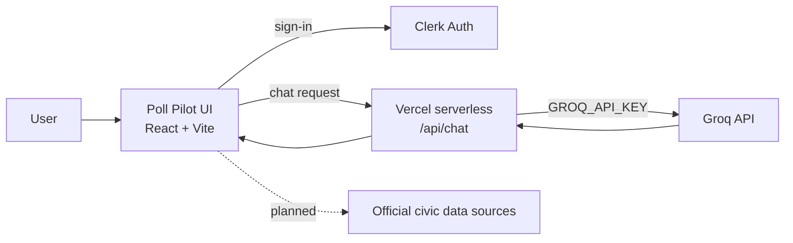

# 🗳️ Poll Pilot

**A multilingual, nonpartisan AI assistant that helps people understand how to take part in elections.**

> Know your rights. Understand your choices. Participate with confidence.

<!-- Replace these with your real links/badges -->
[Live demo](#) · [Report a bug](../../issues) · [Request a feature](../../issues)


---

## Table of contents

- [Why Poll Pilot?](#-why-poll-pilot)
- [Features](#-features)
- [Civic roadmap](#-civic-roadmap)
- [Nonpartisan by design](#-nonpartisan-by-design)
- [Tech stack](#-tech-stack)
- [Architecture](#-architecture)
- [Getting started](#-getting-started)
- [Deployment](#-deployment)
- [Responsible AI & limitations](#-responsible-ai--limitations)
- [Project status & roadmap](#-project-status--roadmap)
- [Contributing](#-contributing)
- [License](#-license)

---

## 🌍 Why Poll Pilot?

Election information is scattered across government websites, news sources, and PDFs, and often only available in one language. Voters end up searching for answers to basic questions:

- Am I registered to vote?
- Where do I vote, and what do I need to bring?
- What are the rules?
- Who is on the ballot, and what issues are being debated?
- When will results be announced?

Poll Pilot brings these answers into one guided, conversational experience, in the voter's own language.

---

## ✨ Features

| Feature | Description |
|---|---|
| 🤖 **AI Civic Assistant** | Fast conversational answers about registration, procedures, voting requirements, timelines, candidates, and issues, powered by the Groq API. |
| 🌐 **Multilingual** | Designed for 20+ languages, including English, Hindi, Kannada, Tamil, Telugu, Spanish, and French. |
| 🧭 **Civic Roadmap** | A step-by-step guide through the whole voting journey (see below). |
| 🔐 **Secure sign-in** | Authentication handled by Clerk. |
| 📱 **Responsive UI** | Works across desktop and mobile. |

**Try asking:**

> "How do I register to vote?"
> "What documents do I need to vote?"
> "Explain this election issue simply."
> "When will results be announced?"

---

## 🧭 Civic roadmap

| Step | Stage | What you'll get |
|:---:|---|---|
| 01 | 📝 **Register** | Registration requirements and deadlines |
| 02 | 📚 **Learn** | Candidates, issues, and key civic information |
| 03 | 📍 **Find your polling place** | Where and when to vote |
| 04 | 🗳️ **Cast your vote** | What to expect on voting day |
| 05 | 📊 **Track results** | Official results and post-election updates |

---

## 🛡️ Nonpartisan by design

Poll Pilot **never** tells users who to vote for, and does not promote campaigns or candidates. It helps users:

- Understand the electoral process and voting rules
- Learn about candidates and issues in a neutral way
- Find official election resources
- Make their own informed decisions

> **The voter decides. Poll Pilot informs.**

---

## 🏗️ Tech stack

| Technology | Purpose |
|---|---|
| ⚛️ React 19 | Frontend application |
| ⚡ Vite | Dev server and build tooling |
| 🔐 Clerk | Authentication |
| 🧠 Groq API | AI civic assistant |
| ▲ Vercel | Hosting and serverless API routes |

---

## 🏛️ Architecture

The browser never talks to Groq directly. Requests go through a serverless function that holds the API key.



---

## 🚀 Getting started

### Prerequisites

- Node.js 18+ and npm
- A [Clerk](https://clerk.com) account
- A [Groq](https://console.groq.com) API key
- (Recommended) the [Vercel CLI](https://vercel.com/docs/cli) to run the API route locally

### 1. Clone and install

```bash
git clone <your-repository-url>
cd poll-pilot
npm install
```

### 2. Configure environment variables

Copy the example file and fill in your values:

```bash
cp .env.example .env
```

```env
# Exposed to the browser (safe: this is a publishable key)
VITE_CLERK_PUBLISHABLE_KEY=your_clerk_publishable_key

# Server-side only. NEVER prefix with VITE_
GROQ_API_KEY=your_groq_api_key
GROQ_MODEL=your_preferred_groq_model
```

> ⚠️ **Security:** Vite exposes any variable prefixed with `VITE_` to the browser bundle. Keep `GROQ_API_KEY` unprefixed and only read it inside the serverless function. Never commit `.env`; make sure it is listed in `.gitignore`.

### 3. Run locally

```bash
# Frontend + serverless API route together (recommended)
vercel dev

# Frontend only (the AI route won't be available)
npm run dev
```

### 4. Build for production

```bash
npm run build
npm run preview
```

---

## ▲ Deployment

1. Push the project to GitHub.
2. Import the repository into [Vercel](https://vercel.com/new).
3. Add environment variables in **Project Settings → Environment Variables**:
   `VITE_CLERK_PUBLISHABLE_KEY`, `GROQ_API_KEY`, `GROQ_MODEL`.
4. Deploy.
5. Verify the live site: sign in, send a chat message, and confirm the Groq key does not appear in the browser's network tab or bundle.

### Recommended API route pattern

A minimal serverless proxy (`api/chat.js`) keeps the key off the client:

```js
export default async function handler(req, res) {
  if (req.method !== "POST") return res.status(405).end();

  // TODO: verify the Clerk session token here before proceeding,
  // and add rate limiting to protect your Groq quota.

  const { messages } = req.body;

  const upstream = await fetch("https://api.groq.com/openai/v1/chat/completions", {
    method: "POST",
    headers: {
      "Content-Type": "application/json",
      Authorization: `Bearer ${process.env.GROQ_API_KEY}`,
    },
    body: JSON.stringify({
      model: process.env.GROQ_MODEL,
      messages: [
        {
          role: "system",
          content:
            "You are a nonpartisan civic assistant. Explain election processes clearly. " +
            "Never recommend candidates or parties. Point users to official election " +
            "authorities for anything jurisdiction-specific or time-sensitive. " +
            "Reply in the user's language.",
        },
        ...messages,
      ],
    }),
  });

  res.status(upstream.status).json(await upstream.json());
}
```

---

## ⚖️ Responsible AI & limitations

Poll Pilot is built around a few principles:

- 🕊️ **Nonpartisan:** no political persuasion or campaign promotion.
- 🌍 **Accessible:** understandable regardless of language or technical knowledge.
- 🔎 **Transparent:** users should be able to tell official information apart from AI-generated explanations.
- 🧠 **Educational:** it explains the process rather than telling people what to think.
- 🔐 **Privacy-conscious:** credentials and user data are handled securely.

**Please note:**

- AI responses can be incomplete, outdated, or wrong, and translations may lose nuance.
- Election rules, deadlines, and polling locations vary by country, state, and district, and change over time.
- **Always confirm important details (registration status, deadlines, ID requirements, polling place) with your official election authority** before acting on them.

---

## 🔮 Project status & roadmap

**Available now:** AI civic assistant, multilingual chat, Clerk authentication, Vercel deployment.

**Planned:**

- [ ] 🗺️ Real-time polling-place discovery
- [ ] 📅 Election countdowns and important dates
- [ ] 🧾 Official election-document integration
- [ ] 🤝 Verified government and election-authority sources
- [ ] 🔎 AI responses with source citations
- [ ] 📊 Official election-result integrations
- [ ] 🔔 Personalized election reminders
- [ ] 🔊 Voice-based civic assistant
- [ ] ♿ Improved accessibility
- [ ] 📱 Progressive Web App support
- [ ] 🌐 Additional regional languages

---

## 🤝 Contributing

Contributions are welcome, especially help with translations, accessibility, and verified data sources.

1. Fork the repo and create a branch: `git checkout -b feature/your-feature`
2. Commit your changes and push the branch
3. Open a pull request describing what changed and why

Please keep contributions nonpartisan: no content that advocates for or against any candidate, party, or campaign.

---

## 📄 License

Add your license here (for example, MIT) and include a `LICENSE` file in the repository.

---

## 🌱 Vision

Make reliable civic information as accessible as a conversation.

**Ask → Understand → Verify → Participate**
